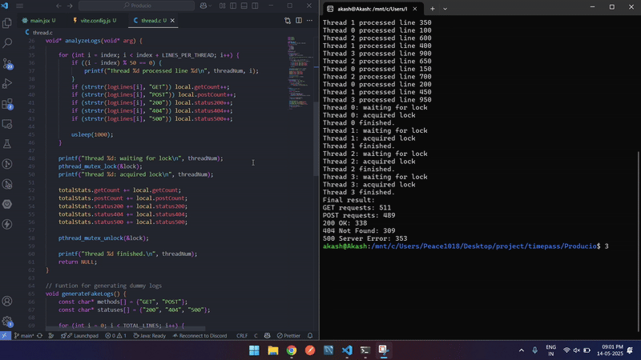

# Multithreaded Log Analyzer in C

This is a small C program that shows how **threads**, **mutex locks**, and **log analysis** work together.

## What this does

- Generates **1000 fake log lines**
- Spawns **4 threads** to process the logs in parallel
- Each thread:
  - Counts `GET` and `POST` requests
  - Counts `200`, `404`, and `500` status codes
- Uses **mutex locks** so all threads update shared data safely
- Shows **how and when** each thread locks and unlocks the critical section

## 🧵 Why threads?

- Threads are lighter than processes
- They **share memory** space → easier and faster data sharing
- Good for tasks like log parsing where work can be divided

## 🔐 Why mutex lock?

- To avoid threads modifying shared variables at the same time
- Prevents race conditions
- Each thread waits its turn to safely update final stats

## 💡 How to run (in Linux or WSL)



```bash
gcc -pthread -o log_thread_demo log_thread_demo.c
./log_thread_demo
